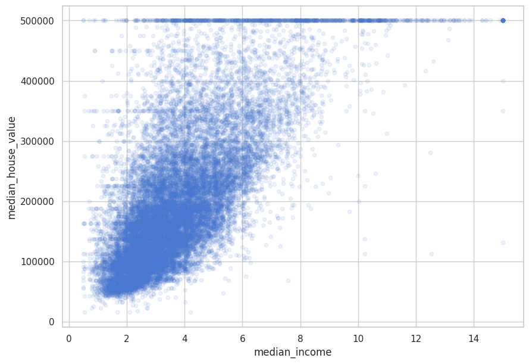
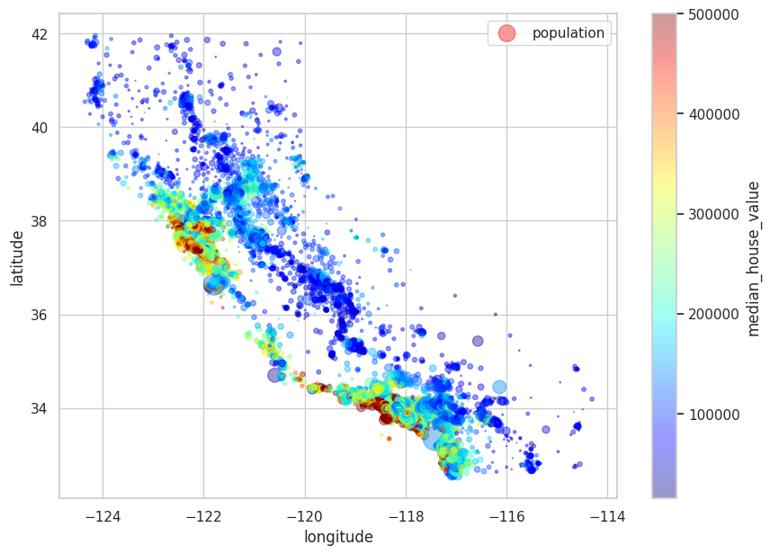
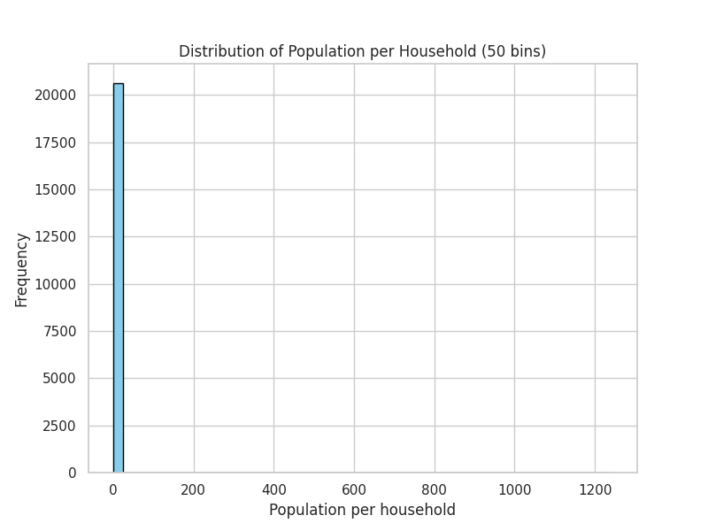
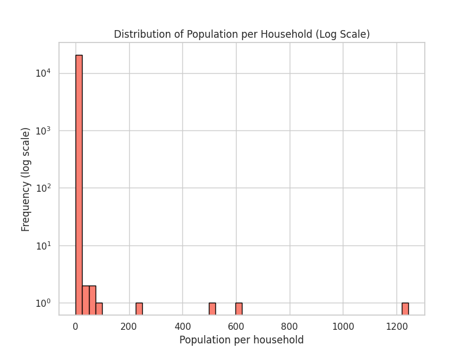
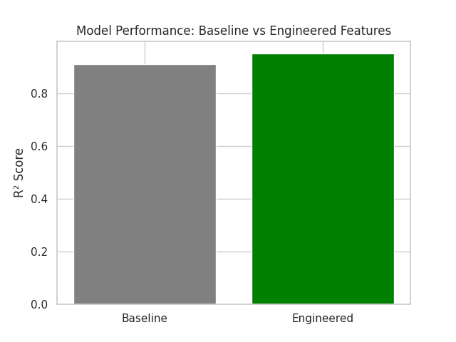
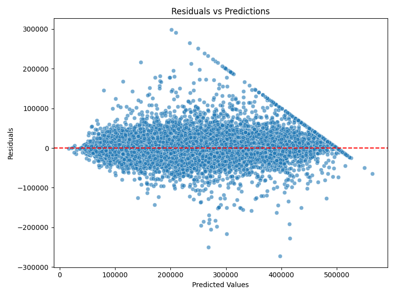
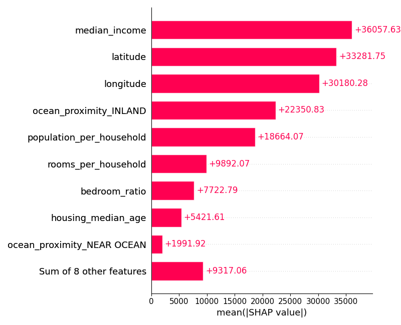
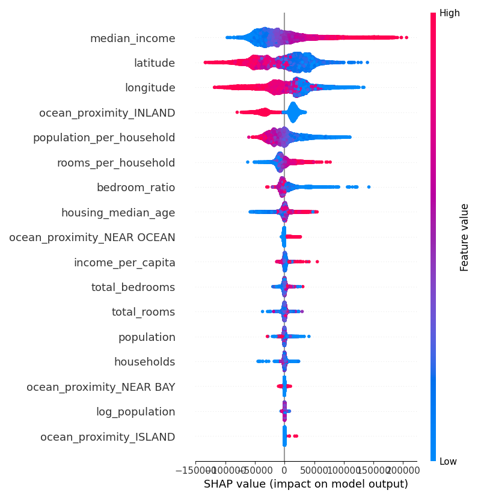

# Analysis from California Housing Project

## Executive Summary
This project analyzes California housing data (1990 census) to uncover drivers of house prices.  
Key findings: **median income** is the strongest predictor, **coastal proximity** raises values, and **feature engineering** improves model accuracy from R² ~0.91 to ~0.95.  
Interpretability via SHAP confirms income and geography as dominant factors, while household density highlights affordability pressures.  
The analysis demonstrates both predictive performance and real‑world relevance.

---

## 1. Dataset Observations
- Median house value ranges from ~$15k to ~$500k, with clusters near San Francisco and Los Angeles.
- Missing values concentrated in `total_bedrooms` (~1.5% of rows).
- Categorical variable `ocean_proximity` shows strong geographic clustering.

---

## 2. Exploratory Analysis
- **Income vs House Value**: Median income has a near‑linear positive correlation with house value.  

- **Latitude/Longitude**: Coastal regions (near SF/LA) show higher values; inland regions consistently lower.  

- **Population Density**: Higher population per household correlates with lower affordability.  
  - Standard histogram shows most households clustered at 1–2 members.  
  - Log‑scaled histogram reveals a long tail of larger households.  
  

---

## 3. Feature Engineering Impact
- Adding `rooms_per_household`, `bedrooms_ratio`, and `income_per_capita` improved model R² from ~0.91 to ~0.95.
- Log‑transforming population stabilized variance in residuals.  

---

## 4. Model Evaluation
- Tuned XGBoost achieved:
  - RMSE: ~26,315  
  - MAE: ~16,624  
  - R²: ~0.95
- Residuals centered around 0, but variance increases for high‑value homes.  

---

## 5. Interpretability
- **Feature Importance**: `median_income` dominates, followed by `latitude` and `longitude`.
- **SHAP Analysis**:
  - Higher income → higher predicted value.
  - Inland proximity → lower predicted value.
  - Latitude/longitude capture regional effects (SF/LA clusters).  
  

---

## 6. Translating Insights
- **Policy**: Affordable housing tied strongly to income distribution and household density.
- **Urban Planning**: Population per household is a proxy for demand pressure.
- **Investment**: Location + income features identify high‑value regions.

---

## 7. Limitations
- Dataset is from 1990 census — not reflective of current market.
- Model optimized for accuracy, not deployment; future work includes MLflow tracking and cloud deployment.
